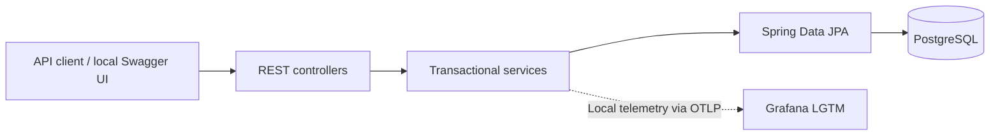

# HR Manager — Java Backend, Observability & Azure Deployment

[](https://github.com/marc2n/hrmanager/actions/workflows/ci.yml)

HR Manager is a portfolio REST API for employees, departments, and employee contracts. It demonstrates a Java 21 / Spring Boot backend with relational persistence, automated tests, local observability, and a tested container delivery workflow to Azure.

The project covers the path from an HTTP request through business rules and database persistence to container scanning, image publishing, deployment, and readiness verification.

## What to review

| Engineering area | Implementation | Evidence |
| --- | --- | --- |
| Backend design | Controllers, transactional services, repositories, and request/response DTOs | [Application source](src/main/java/de/mtala/hrmanager) |
| Data integrity | Flyway migrations, foreign keys, uniqueness constraints, positive salary constraint, and JPA auditing | [Schema migration](src/main/resources/db/migration/V1__create_hr_schema.sql) |
| Testing | Service and controller unit tests, Spring Boot / MockMvc integration tests with H2, and JaCoCo coverage reports | [Tests](src/test/java/de/mtala/hrmanager), [JaCoCo configuration](pom.xml) |
| Observability | Local OTLP export of metrics, traces, and logs to Grafana LGTM | [Local configuration](src/main/resources/application-local.yaml) |
| Container delivery | Tests, Trivy checks, image transfer without rebuilding, ACR publishing, and deployment by digest | [CI workflow](.github/workflows/ci.yml) |
| Azure infrastructure | Terraform for Container Apps, PostgreSQL, ACR, managed identities, and remote state | [Infrastructure](infra) |

## API scope

- Create, list, retrieve, and delete departments and employees.
- Create an employee's contract alongside the employee, using the hire date as the contract start date.
- Reject duplicate employee emails and department names in the service layer, backed by database uniqueness constraints.
- Prevent deletion of a department while it contains employees.
- Track creation and modification timestamps through JPA auditing.

## Architecture

The application is a single Spring Boot service with separate controller, service, and persistence layers.



Departments contain employees; each employee has a contract. DTOs separate API payloads from persistence entities. Flyway owns schema changes, while Hibernate validates the schema at startup. Open Session in View is disabled, and DTO mapping takes place within service transactions.

In Azure, the application runs in Azure Container Apps, pulls its image from ACR using a managed identity, and connects to Azure Database for PostgreSQL. Terraform also configures a Log Analytics workspace for the Container Apps environment.

## Run locally

Prerequisites: Git and Docker with Docker Compose. The container build supplies Java and Maven; a local JDK is only needed to run the Maven tests directly. Ports 8080, 3000, 5432, 4317, and 4318 must be available.

```bash
git clone https://github.com/marc2n/hrmanager.git
cd hrmanager
```

Create `.env` in the repository root with these local demo values:

```dotenv
SPRING_DATASOURCE_URL=jdbc:postgresql://postgres:5432/hr
SPRING_DATASOURCE_USERNAME=hrlocal
SPRING_DATASOURCE_PASSWORD=local-demo-only
SPRING_DATASOURCE_DATABASE_NAME=hr
INIT_DB=true
```

The database hostname is `postgres` because the application runs inside the Compose network. Compose supplies the application's telemetry endpoint as `http://grafana-lgtm:4318`.

```bash
docker compose up --build
```

`INIT_DB=true` enables sample data in the local profile. The initializer adds three departments and three employees when there are no departments yet. PostgreSQL data persists in a Docker volume between runs.

| Entry point | URL |
| --- | --- |
| Employee API | http://localhost:8080/api/employees |
| Department API | http://localhost:8080/api/departments |
| Swagger UI — local profile | http://localhost:8080/swagger-ui/index.html |
| OpenAPI document — local profile | http://localhost:8080/v3/api-docs |
| Readiness, including database health | http://localhost:8080/actuator/health/readiness |
| Grafana | http://localhost:3000 |

For a quick check, open the employee API in a browser. With a fresh database and seeding enabled, it returns the sample employees. The readiness endpoint should return `{"status":"UP"}` once startup completes.

Stop the services while retaining database data:

```bash
docker compose down
```

## Endpoints

| Method | Path | Operation |
| --- | --- | --- |
| GET | `/api/departments` | List departments and employee counts |
| GET | `/api/departments/{id}` | Retrieve a department |
| POST | `/api/departments` | Create a department |
| DELETE | `/api/departments/{id}` | Delete an empty department |
| GET | `/api/employees` | List employees |
| GET | `/api/employees/{id}` | Retrieve an employee |
| POST | `/api/employees` | Create an employee and contract |
| DELETE | `/api/employees/{id}` | Delete an employee and associated contract |

Example employee request for an existing `Engineering` department, available in the seeded local database:

```json
{
  "firstName": "Ada",
  "lastName": "Lovelace",
  "email": "ada@example.com",
  "hireDate": "2026-01-10T00:00:00Z",
  "status": "ACTIVE",
  "departmentName": "Engineering",
  "salary": 100000.00
}
```

Send this body to `POST /api/employees` using the local Swagger UI. A successful creation returns HTTP 201 and the employee response. Employment statuses are `ACTIVE`, `ON_LEAVE`, `TERMINATED`, and `PROBATION`.

## Tests

With JDK 21 installed:

```bash
chmod +x mvnw
./mvnw -B -ntp clean verify
```

On Windows PowerShell:

```powershell
.\mvnw.cmd -B -ntp clean verify
```

The suite includes 18 service unit tests, 8 controller unit tests, and 6 Spring Boot / MockMvc integration tests. Integration tests use H2 with Flyway enabled and exercise API lifecycles, validation, and business-rule failures. Surefire reports are written to `target/surefire-reports/` and uploaded by CI.

JaCoCo 0.8.14 collects coverage during the tests and generates its report in the Maven `test` phase. After `clean verify`, open `target/site/jacoco/index.html` in a browser to inspect package and class coverage. CI uploads the report as the `jacoco-coverage-report` artifact: download it from a completed workflow run, extract the archive, and open `index.html`.

## Observability

The local profile exports metrics, traces, and logs over OTLP to the Grafana LGTM container. The OpenTelemetry Logback appender connects application logging to the telemetry pipeline. Local tracing uses a sampling probability of 1.0.

Generate traffic through Swagger UI or the API, then use Grafana Explore to inspect request traces, service logs, and metrics. The repository currently provides the stack configuration but does not include provisioned application dashboards or alert rules.

## CI and deployment

Pushes and pull requests targeting `main` run:

1. Maven tests with JaCoCo coverage reporting and uploaded test/coverage artifacts.
2. Trivy filesystem/dependency scanning for HIGH and CRITICAL findings, ignoring vulnerabilities without fixes.
3. A Docker image build and a Trivy image scan for CRITICAL findings, also ignoring vulnerabilities without fixes.

A manual run on `main` with `publish=true` additionally:

1. Saves and transfers the scanned image as a workflow artifact.
2. Authenticates to Azure through GitHub OIDC and pushes the image to ACR.
3. Passes the image digest to the deployment job and reconstructs the full image reference there.
4. Updates Azure Container Apps using the digest reference.
5. Confirms that the target revision uses the expected image, becomes healthy, and returns readiness `UP`.
